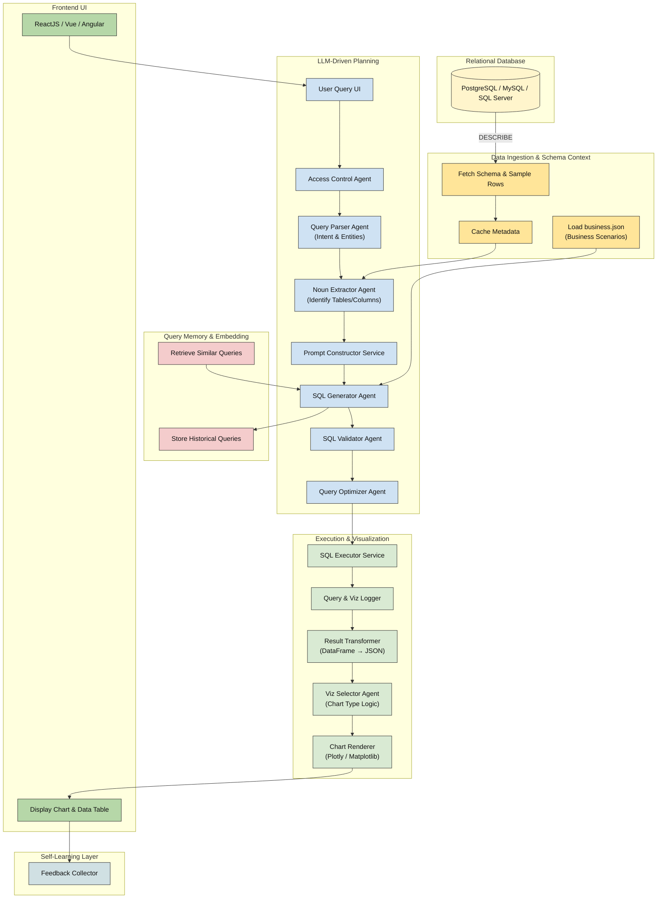

```mermaid
flowchart TB
%% Data Source
subgraph Relational_Database["Relational Database"]
DB[(PostgreSQL / MySQL / SQL Server)]
end

%% Ingestion & Schema
subgraph Ingestion["Data Ingestion & Schema Context"]
A1["Fetch Schema & Sample Rows"]
A2["Cache Metadata"]
A3["Load business.json\n(Business Scenarios)"]
end

%% Query Memory
subgraph Embedding["Query Memory & Embedding"]
E1["Store Historical Queries"]
E2["Retrieve Similar Queries"]
end

%% NLP & Planning
subgraph NLP["LLM-Driven Planning"]
B1["User Query UI"]
B1a["Access Control Agent"]
B2["Query Parser Agent\n(Intent & Entities)"]
B3["Noun Extractor Agent\n(Identify Tables/Columns)"]
B4a["Prompt Constructor Service"]
B4["SQL Generator Agent"]
B5["SQL Validator Agent"]
B5a["Query Optimizer Agent"]
end

%% Execution
subgraph Execution["Execution & Visualization"]
C1["SQL Executor Service"]
C1a["Query & Viz Logger"]
C2["Result Transformer\n(DataFrame → JSON)"]
C3["Viz Selector Agent\n(Chart Type Logic)"]
C4["Chart Renderer\n(Plotly / Matplotlib)"]
end

%% Feedback Loop
subgraph Feedback["Self-Learning Layer"]
F1["Feedback Collector"]
end

%% Frontend
subgraph Frontend["Frontend UI"]
D1["ReactJS / Vue / Angular"]
D2["Display Chart & Data Table"]
end

%% Flow Connections
DB -->|DESCRIBE| A1
A1 --> A2
A3 --> B4
A2 --> B3

D1 --> B1
B1 --> B1a --> B2 --> B3 --> B4a --> B4
E2 --> B4
B4 --> B5 --> B5a --> C1 --> C1a --> C2 --> C3 --> C4 --> D2 --> F1
B4 --> E1

%% Styling
classDef dataSource fill:#fff5cc,stroke:#333,stroke-width:1px,color:#111,font-size:16px;
classDef ingestion fill:#ffe599,stroke:#333,stroke-width:1px,color:#111,font-size:16px;
classDef nlp fill:#cfe2f3,stroke:#333,stroke-width:1px,color:#111,font-size:16px;
classDef exec fill:#d9ead3,stroke:#333,stroke-width:1px,color:#111,font-size:16px;
classDef frontend fill:#b6d7a8,stroke:#333,stroke-width:1px,color:#111,font-size:16px;
classDef embedding fill:#f4cccc,stroke:#333,stroke-width:1px,color:#111,font-size:16px;
classDef feedback fill:#d0e0e3,stroke:#333,stroke-width:1px,color:#111,font-size:16px;

class DB dataSource;
class A1,A2,A3 ingestion;
class B1,B1a,B2,B3,B4,B4a,B5,B5a nlp;
class C1,C1a,C2,C3,C4 exec;
class D1,D2 frontend;
class E1,E2 embedding;
class F1 feedback;
```
